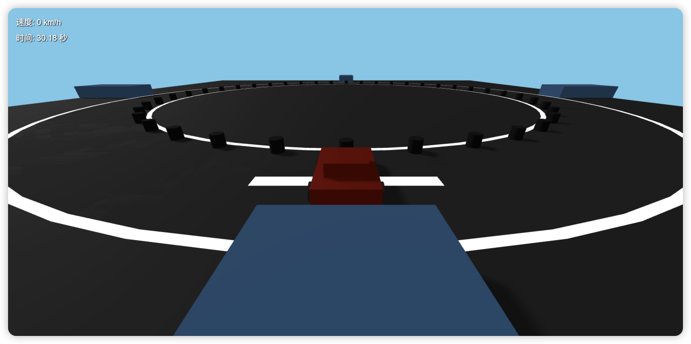
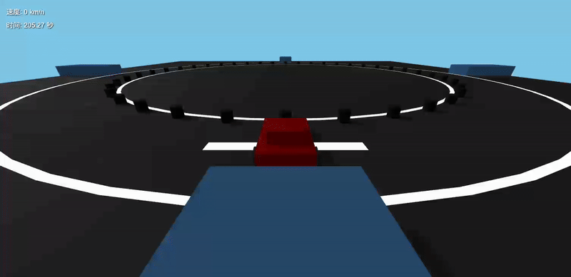

# 零代码生成 3D 游戏：基于 Amazon Q Developer CLI 和 Three.js 的实践

**Amazon Q Developer** 是一个由生成式人工智能（AI）驱动的对话助手，可帮助你理解、构建、扩展和运维 AWS 应用程序。你可以向它询问关于 AWS 架构、你的 AWS 资源、最佳实践、官方文档、技术支持等问题。Amazon Q 不断更新其能力，确保为你的问题提供最具上下文相关性和可操作性的答案。

**Amazon Q Developer CLI** 能整合上下文信息，使 Amazon Q 更深入理解你的使用场景，从而提供相关且具有上下文感知的响应。当你开始输入命令时，Amazon Q 会自动补全相关的子命令、选项和参数。

**three.js** 是一个构建于 WebGL 之上的轻量级 3D 游戏引擎。它是一个 JavaScript 3D 库，使开发者可以轻松地在浏览器中使用 WebGL 创建和展示动画 3D 图形。three.js 屏蔽了底层图形 API 的复杂性，允许开发者用简洁、高层次的代码构建沉浸式、交互式的 3D 体验。无论你是在创建数据可视化、仿真系统、游戏，还是产品展示，three.js 都能以高性能、灵活性和易用性，帮助你将创意变为现实。


# 客户场景
游戏行业的客户，在发行游戏产品时，需要制作大量的广告视频素材用于投放。因为广告素材的生命一般都很短，只有几天时间。客户为了保证广告投放效果稳定，必须持续制作大量视频素材，进行AB Test。这占用了他们大量的研发和美术人力资源。所以，客户为了提升生产效率，降低人力成本，希望利用生成式人工智能来帮助他们。
又因为游戏行业的特性，这些广告素材的内容区别于其他行业的传统广告。它们通常使用的是自己游戏的美术设计，例如：角色的3D模型、卡通界面、技能特效等。因为和真实世界的场景差别很大，这使得目前主流的生成式模型无法帮助他们生成广告视频。并且在视频中，客户经常要求视频中的多个游戏角色，按照剧本进行互动，推进剧情发展。这也超出了目前主流的生成式模型的能力范围。

# 解决方案
使用 Amazon Q Developer CLI 的方式，引入 Amazon Q 强大的人工智能能力，结合 three.js 3D游戏引擎，生成mini游戏。再通过视频录制，生成视频广告素材。客户通过替换自己游戏的美术资源，实现批量生成视频素材，满足AB Test的数量需求。通过 Amazon Q Developer CLI 的对话方式，可以在不写代码的情况下改编演出剧本，使广告创意人员可以独立实现效果。three.js 的渲染可运行于云端的 Headless 浏览器环境（如 Puppeteer + Headless Chrome），实现离线式、自动化的视频渲染流程，适合批量生成广告素材，支持多线程渲染和扩展性部署。同时因为 three.js 是开源项目，Amazon Q 可以理解和参考 three.js 的全部代码和文档，获得比其他商用闭源引擎更好的准确性。

# 方案实施步骤
1. 安装 Amazon Q for command line.
2. 克隆 three.js git 仓库到本地电脑.
3. 使用 Amazon Q Developer CLI 理解 three.js 工程的代码和文档。
4. 使用 Amazon Q Developer CLI 编写一个游戏创建计划。
5. 使用 Amazon Q Developer CLI 根据计划创建一个mini游戏工程。

# 实验验证
以下实验过程中，人工没有编写任何一行代码。也没有浏览过任何工程代码。本地环境中不需要任何编程IDE。

以下是使用到的关键提示词：

1. 使用 Amazon Q Developer CLI 理解 three.js 工程的代码和文档。
    > 这个路径下,是从three.js clone 的git库,其中包含全部的代码和文档.我想用之后利用这些信息,指导你来制作一款基于three.js的游戏.那这些资料应该如何整理?我可以使用AWS上的服务,比如Bedrock,也可以使用Knowledgebase.给出最合理和最正确的建议.我需要稳定和可靠的工作质量.

2. 提出创建小游戏的具体要求，并要求 Amazon Q Developer 先制定计划。此步骤结束时，mini游戏工程已经创建完成，并可以在浏览器中运行。
   > 创建一个赛车的小游戏,放到这个路径 /Users/valyli/three-js-demo . 创建之前,先做规划,确定创建的步骤.把这个计划写入一个markdown文档.后续创建过程中,每一个步骤都重新与这个计划文档进行核对,并标注完成的状态.通过这个方法来确保创建过程的质量,保证最终输出的游戏工程可以正确运行.在这个版本中,最重要的是做出这个小游戏,能够正常演示.并不需要复杂的玩法和功能.

3. 修复BUG。可以看到，对于3D场景，模型在坐标系上的处理还稍显逊色。需要辅助输入更多的调试信息才能修正。
    > 现在游戏已经能够运行,车子也可以控制.但是有一些bug:
    1. 车子的左右方向控制反了
    2. 车子的方向控制,参照系好像不是车子本身

    > 新的问题,镜头跑到车的下面了.应该是在车的上方,跟随在斜后方的位置

    > 前进和后退的参照系,需要以车体的坐标系为准

    > W和S键,控制方向的逻辑不对.当车体发生方向旋转后,W和S的操作结果就混乱了.重新检查这2个按键的控制逻辑.一定要根据车头当前的方向来判断.

    > W产生的推力,必须沿车头方向向前;S产生的推力,必须沿车尾方向向后.你现在提供的程序,没有实现这个效果.这部分代码重新生成

    > 还是一模一样的问题,没有修复.发现一个现象,当车从初始位置出发,转向超过180度后,W和S键作用对调了

    > 这次修改后,W和S键已经无效了

    > 还是不动

4. 添加物理碰撞。结束整个生成过程。
    > 现在按键控制已经正确.我还是希望能有物理模型,以及碰撞的功能.请添加


# 生成效果展示




# 生成过程记录
[record](./amazon-q-cli-record.md)


# 生成的demo工程
[project code](./three-js-demo/)

# 本地渲染原型设计（验证思路）
在本项目中，我们不仅实现了基于Three.js的3D游戏，还提供了一个强大的功能：将游戏画面渲染为视频文件。这个功能对于生成广告素材特别有用，让创意人员可以轻松录制游戏场景，用于营销推广。下面我们来详细解析这个功能的实现原理和使用方法。

## 渲染服务器与客户端代码分析

### 渲染服务器 (render_server)
渲染服务器主要由以下几个部分组成：

1. **server.js**：核心服务器代码
   - 使用Express创建Web服务器，提供静态文件服务
   - 使用Socket.IO建立与客户端的实时通信
   - 接收客户端发送的每一帧画面，并写入FIFO管道
   - 与FFmpeg协同工作，将帧序列转换为视频文件

2. **render.sh**：渲染脚本
   - 接收参数：视频尺寸、输出文件名、帧率
   - 创建FIFO管道用于数据传输
   - 启动Node.js服务器并将其输出通过管道传给FFmpeg
   - FFmpeg负责将原始帧数据编码为视频文件

### 客户端代码 (three-js-demo)
客户端代码主要在`main.js`文件中实现了与渲染服务器的通信：

1. **Socket.IO连接**：
   - 检测URL参数中是否包含`size`参数，以确定是否处于渲染模式
   - 建立与渲染服务器的Socket.IO连接

2. **帧捕获逻辑**：
   - 在游戏循环中捕获每一帧的渲染结果
   - 将渲染结果转换为PNG格式的数据URL
   - 通过Socket.IO发送给服务器

## 实现原理

整个视频渲染过程的工作流程如下：

1. 用户执行`render.sh`脚本，指定视频参数
2. 脚本创建FIFO管道，启动Node.js服务器
3. 服务器启动Chrome浏览器，加载游戏页面
4. 游戏页面检测到渲染模式，连接到Socket.IO服务器
5. 服务器请求第一帧，客户端渲染并发送
6. 服务器接收帧数据，转换后写入FIFO管道
7. FFmpeg从管道读取数据，编码为视频文件
8. 重复步骤5-7直到游戏结束或用户中断

## 如何在Three.js项目中添加视频渲染功能

要在自己的Three.js项目中添加类似的视频渲染功能，可以按照以下步骤操作：

1. **准备渲染服务器**：
   - 复制`render_server`目录到你的项目中
   - 安装必要的依赖：`npm install express socket.io get-pixels`

2. **修改客户端代码**：
   - 在游戏的主JavaScript文件中添加以下代码：

   ```javascript
   // 全局变量，用于存储socket连接
   let socket;

   // 在初始化函数中添加
   function init() {
     // 原有的初始化代码...
     
     // 检查是否处于渲染模式
     if (location.search.includes('?size=')) {
       initRenderMode();
     }
   }

   // 渲染模式初始化
   function initRenderMode() {
     // 解析尺寸参数
     const sizeParam = location.search.split('?size=')[1];
     const [width, height] = sizeParam.split('x').map(Number);
     
     // 调整渲染器尺寸
     renderer.setSize(width, height);
     
     // 连接到Socket.IO服务器
     socket = io();
     
     // 发送问候
     socket.emit('greetings', {});
     
     // 监听服务器请求
     socket.on('nextFrame', function(ready) {
       // 渲染一帧并发送
       renderer.render(scene, camera);
       const dataURL = renderer.domElement.toDataURL('image/png');
       socket.emit('newFrame', { png: dataURL });
     });
   }

   // 在游戏循环中添加（可选，用于持续发送帧）
   function gameLoop() {
     // 原有的游戏循环代码...
     
     // 渲染场景
     renderer.render(scene, camera);
     
     // 如果在渲染模式下，发送当前帧
     if (socket && socket.connected) {
       const dataURL = renderer.domElement.toDataURL('image/png');
       socket.emit('newFrame', { png: dataURL });
     }
   }
   ```

3. **使用方法**：
   - 确保FFmpeg已安装在系统中
   - 执行渲染脚本：`./render.sh -s 640x480 -o output.mp4 -f 24`
   - 参数说明：
     - `-s`: 视频尺寸（宽x高）
     - `-o`: 输出文件名
     - `-f`: 帧率

通过这种方式，你可以轻松地将任何Three.js项目转换为视频生成工具，为广告创意提供更多可能性。


# 云端渲染部署方案

为满足云上自动化生产需求，我们可将渲染流程部署在 AWS 云端主机上：

- 使用 **EC2** 或 **Fargate 容器** 启动 Node.js + Puppeteer 服务  
- 云端 **Headless Chrome** 加载 three.js 页面，自动运行指定剧本  
- 使用 **FFmpeg** 录制帧序列为高质量视频  
- 最终输出上传至 **Amazon S3**，供后续使用  

该方案具备以下优势：

- **可横向扩展**，适配 AB Test 批量素材生成  
- **可追踪、复现渲染过程**（容器 ID + 剧本输入 + Git 哈希）  
- 可与 **Step Functions / EventBridge** 编排流程，或结合 **Bedrock** 自动生成剧本与文案 

## Node.js + Puppeteer + FFmpeg 示例代码

```js
// render.js - Node.js 脚本，用于云端自动渲染并录制

const puppeteer = require('puppeteer');
const { spawn } = require('child_process');
const fs = require('fs');

(async () => {
  const browser = await puppeteer.launch({
    headless: true,
    args: ['--no-sandbox', '--disable-gpu'],
  });

  const page = await browser.newPage();
  const width = 1280, height = 720;
  await page.setViewport({ width, height });

  // 载入 three.js 游戏页面
  await page.goto('https://your-s3-site-url/game.html?record=true');

  // 启动 FFmpeg 进程，录制屏幕帧
  const ffmpeg = spawn('ffmpeg', [
    '-y',
    '-f', 'image2pipe',
    '-r', '24',
    '-i', '-',             // 从 stdin 接收图像帧
    '-c:v', 'libx264',
    '-pix_fmt', 'yuv420p',
    'output.mp4'
  ]);

  // 持续抓取页面帧并传入 FFmpeg
  for (let i = 0; i < 240; i++) {  // 录制 10 秒（24fps）
    const screenshot = await page.screenshot({ type: 'png' });
    ffmpeg.stdin.write(screenshot);
  }

  ffmpeg.stdin.end();
  await browser.close();
})();
```

## 使用说明

- 将 `render.js` 脚本部署在 **EC2** 或 **Fargate** 容器中运行  
- 将 `game.html` 托管在 **Amazon S3** 并启用静态网站托管功能  
- 渲染完成后生成的 `output.mp4` 可通过 AWS CLI 上传至 S3：

```bash
aws s3 cp output.mp4 s3://your-bucket/ads/output.mp4
```

# 对照组测试
在对照组测试中，我们向 Amazon Q Developer CLI 提出同样的要求，但不再提供 three.js 的代码和文档。观察它的生成过程。

1. 移除理解 three.js 工程和文档的部分。然后输入一样的提升词，要求生成一个小游戏。
    > 创建一个赛车的小游戏,放到这个路径 /Users/valyli/three-js-demo-2 . 创建之前,先做规划,确定创建的步骤.把这个计划写入一个markdown文档.后续创建过程中,每一个步骤都重新与这个计划文档进行核对,并标注完成的状态.通过这个方法来确保创建过程的质量,保证最终输出的游戏工程可以正确运行.在这个版本中,最重要的是做出这个小游戏,能够正常演示.并不需要复杂的玩法和功能.

2. 观察生成过程，发行这次 Amazon Q Developer CLI 执行了 three.js 的安装步骤。


    ```bash
    🛠️  Using tool: execute_bash (trusted)
    ⋮ 
    ● I will run the following shell command: 
    cd /Users/valyli/three-js-demo-2 && npm install three@0.159.0 serve@14.2.1
    ⋮ 
    ↳ Purpose: 安装项目依赖


    added 91 packages, and audited 92 packages in 7s

    24 packages are looking for funding
    run `npm fund` for details

    3 high severity vulnerabilities

    To address all issues, run:
    npm audit fix --force

    Run `npm audit` for details.
    ```

3. 我们利用其中的关键步骤，three.js 的库引用方式进行分析。
   1. 对照组
    ```bash
    npm install three@0.159.0 serve@14.2.1
    ```
    这个安装命令在 three.js 官方文档无法找到。所以是 Amazon Q Developer CLI 根据模型已有的知识生成。
   
    2. demo
   ```html
    <!-- 引入 Three.js 库 -->
    <script src="https://cdn.jsdelivr.net/npm/three@0.160.0/build/three.min.js"></script>
   ```
   这个引用方式，可以在官方文档中找到。说明 Amazon Q Developer CLI 在按照要求理解文档后执行的生成。
   相关文档：https://threejs.org/manual/#en/installation

所以，通过要求 Amazon Q Developer CLI 理解指定文档和代码的方式，能够更准确的按照我们的意愿生成内容。我们可以通过这样的方式，为模型输入更高质量的信息，以及我们需求中特有的信息。

# 附录

1. Amazon Q for command line 安装说明

https://docs.aws.amazon.com/amazonq/latest/qdeveloper-ug/command-line-installing.html

2. three.js github 地址

https://github.com/mrdoob/three.js
